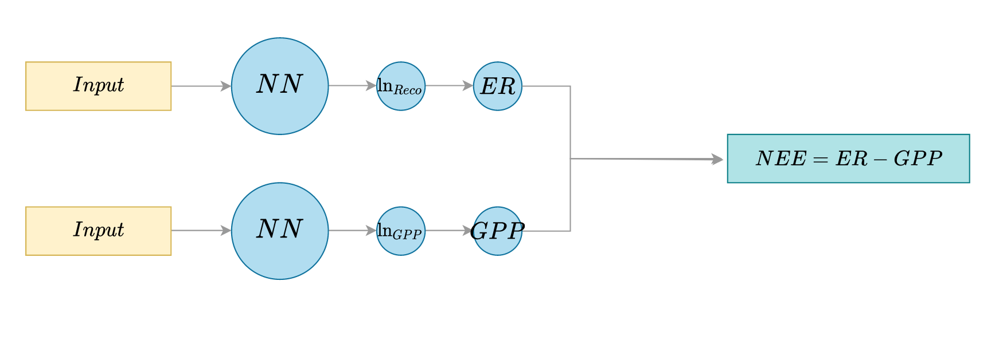

# HMC for net carbon dioxide fluxes partitioning

## Context

Net carbon fluxes partitioning consists of inferring two variables that compose a single observable one. These variables are:

- the Net Ecosystem Exchange (NEE), which can be measured with the eddy covariance method;
- the CO2 release flux due to the respiration process (Reco);
- the CO2 uptake flux due to photosynthesis (GPP);

Those variables have different drivers and are connected with the relation: NEE = Reco - GPP. As NEE is the only observable one, we have to "guess" the other two using physical knowledge and some of their properties. More specifically, GPP is light-dependent and is therefore null during nighttime. This makes it possible to train two models to predict GPP and Reco respectively by only using NEE values as training data.

The model follows this architecture:



Our goal is to use HMC for computing uncertainty estimates for NEE, GPP and Reco.

## Installation

This project uses Python 3.9. Setting up the python environment can be done conveniently using Pipenv, by running the following at the root of the project (the first line can be omitted if you already have Pipenv installed for Python 3.9):

```
python3.9 -m pip install pipenv
python3.9 -m pipenv install
python3.9 -m pipenv shell
export PYTHONPATH=src/
```

The SCOPE dataset to use needs to be placed in `data/` (the code is using the file `NNinput_SCOPE_US_Ha1_1314.csv` by default, which needs to be downloaded separately)

## Repository organization

- `src/` contains the source code and the experiments;
- `etc/` is a used as default storage for experiment results and buffer files;
- `data/` is where the data sets are supposed to be downloaded;

## Tensorflow-Probability implementation

`src/tfp_hmc` contains an implementation of this problem using the `tensorflow-probability` backend. It is inspired by https://janosh.dev/blog/hmc-bnn.

The architecture is slightly different as it uses "split-head" models to predict normal distributions instead of point estimates.

To use this code, simply set the experiment parameters at the beginning of the `main.py` file, and from `src/` run:

```
python tfp_hmc/main.py
```


## Tensorflow "vanilla" implementation

`src/hmc_old` contains an implementation from scratch of the HMC method. The class `HMC` takes a Keras model and acts as a convenient way to sample parameters for this model. It uses a Laplacian prior distribution for the parameters, and the code to use this tool is in `flux_NN.ipynb`. While this code works on small-scale tests, it never achieved convincing results on Flux Partitioning.

The experiments with this code are contained in the Jupyter Notebook `flux_NN.ipynb`.
